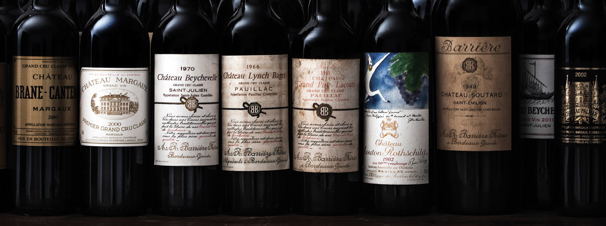

### L'entreprise 
  

Mon stage à été réalisé au sein de la société **Barrière Frères**.  
Cette société ainsi que les châteaux Beychevelle et Beaumont appartiennent à la holding GRANDS MILLESIMES DE FRANCE.
Cette holding est la jointure des sociétés  Suntory et Castel.
  
Barrière Frères est une maison de négoce de vins spécialisée dans les Grands Crus de Bordeaux.   
Elle distribue également des grands vins internationaux ainsi que leurs productions de vins (assemblés et élevés sous leurs propres marques).  
Leur clientèle est très large : du particulier, aux hôtels/restaurants et sociétés.  
  
  
L'entreprise de plus de 80 ans, se situe à [Ludon Médoc](https://goo.gl/maps/nw3G6tg4TG2qahfP6) en plein milieu des vignes confère un environnement de travail apaisant et calme.
Son entrepôt de 8500 m2 permet un stockage massif de toute une gamme de vin dans tous les formats possibles (de la demi-bouteille au melchior).

Mon tuteur de stage a été Mr [Anthony JAULIN] (https://www.linkedin.com/in/anthony-jaulin-5083a4a0/).  
Il est responsable des systèmes d'Information pour le groupe. Son accompagnement a été très attentionné. En effet, il a toujours pris le temps de me montrer tout en m’expliquant chaque chose qu’il entreprend malgré qu’il soit très demandé. J’ai beaucoup apprécié le fait d'être dans son équipe. 

Barrière frères est une société qui possède deux dirigeants, chacun ayant son expertise :
Mr Stanislas CASTEX
Mr Frédéric ROBERT

Mr ROBERT étant le directeur des opérations, c’est avec lui qu'il y avait le plus d'interactions sur le côté analyse logistique.

Site internet de la société : [Barrière Frères](https://barriere-freres.fr)
